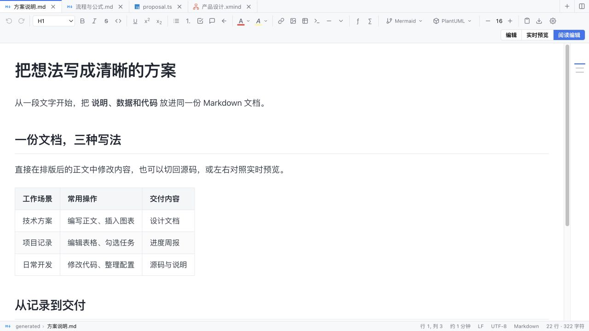
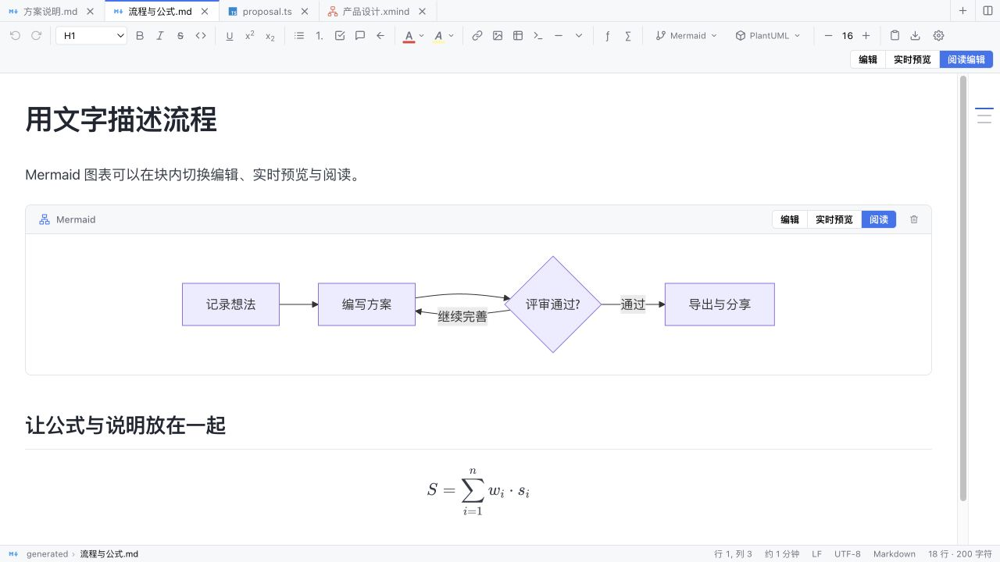
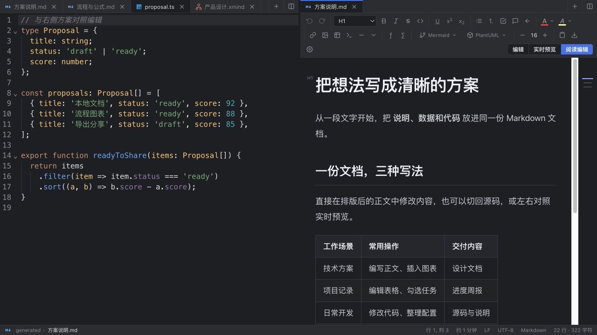

# DEditor

**写 Markdown、改代码、画思维导图，一个编辑器就够。**

DEditor 面向 macOS 和 Windows，把 Markdown 可视化写作、多语言代码编辑和 XMind 编辑放进同一个本地工作区。适合写技术方案、整理笔记、修改配置，以及对照文档做日常开发。

[核心特点](#核心特点) · [与常用编辑器相比](#与常用编辑器相比) · [效果展示](#效果展示) · [快速开始](#快速开始)



## 核心特点

- **写作方式随时切换**：Markdown 源码、左右实时预览、阅读编辑三种模式；直接修改排版后的正文，切换模式后继续撤销。
- **表格和图表就地处理**：表格批量增删行列、对齐、矩形选择；Mermaid / PlantUML 块内编辑与预览，支持数学公式、任务列表、脚注和目录。
- **常用代码工具内置**：多语言高亮、多光标、列选、折叠、命令面板；JSON 格式化、压缩与键排序，SQL 方言格式化，跨文件搜索与替换。
- **文档与代码并排工作**：左右独立标签组、独立滚动，支持同一文件双视图和双栏差异比较。写方案时可以随手核对实现。
- **从想法到交付**：编辑 XMind 的主题、层级、联系与样式；Markdown 可导出 HTML、PDF、DOCX、PPTX 等格式，图表可导出 SVG。
- **围绕本地文件工作**：草稿恢复、历史版本差异、可选自动保存、本地图片整理；明暗主题、中英文界面。基于 Tauri，复用系统 WebView，无需随应用捆绑 Chromium。

## 与常用编辑器相比

如果你习惯这些编辑器，可以这样理解 DEditor 的定位：

| 编辑器 | 熟悉的能力与侧重点 | DEditor 对应的体验 |
| --- | --- | --- |
| [Sublime Text](https://www.sublimetext.com/) | 多重选择、分屏、快速导航，侧重代码与文本编辑 | 提供多光标、分屏与快速导航，并内置 Markdown 阅读编辑和图表展示 |
| [Typora](https://typora.io/) | 在排版后的 Markdown 中直接写作，支持表格、公式与图表 | 提供可视化写作，同时保留源码、双栏预览，以及独立代码文件编辑 |
| [Notepad++](https://npp-user-manual.org/docs/user-interface/) | 文本与代码处理、搜索替换、多标签和插件 | 集成常用文本工具、JSON / SQL 格式化，再加入文档排版、导出与 XMind 编辑 |

**DEditor 的特点是把这些日常工作连起来，减少写文档、改代码、整理导图时的应用切换。** 上表依据所链接的官方介绍与手册概括常见用途；插件可能扩展各编辑器的能力，不代表完整功能或性能排名。

## 效果展示

以下为真实产品组件的浏览器截图，内容全部来自[自建展示样例](tests/readme-showcase.tsx)。桌面系统标题栏和原生菜单未包含在截图中。

### 用文字画流程，图表留在文档里

Mermaid 图表支持块内「编辑 / 实时预览 / 阅读」切换，正文与公式一起排版。



### 左边看代码，右边写说明

左右面板可以打开不同文件，也可以对照同一文件；各自保留显示模式和滚动位置。



<details>
<summary>查看 XMind 思维导图效果</summary>

在同一工作区打开 `.xmind`，编辑主题、调整层级、设置样式，再保存为 XMind 文件。


XMind 版本与模板兼容性仍在持续核对，详见[验收范围](docs/xmind-acceptance-matrix-2026-09-11.md)。

</details>

## 快速开始

准备 Node.js 22 / 24、npm 和 Rust stable。macOS 需要 Xcode Command Line Tools；Windows 需要 Microsoft C++ Build Tools 和 WebView2。

```sh
npm ci
```

| 操作 | macOS | Windows（PowerShell） |
| --- | --- | --- |
| 启动开发版 | `./scripts/start.sh` | `.\scripts\start.ps1` |
| 构建安装包 | `./scripts/build-mac.sh` | `.\scripts\build-win.ps1` |

启动后打开文件或拖入文件夹作为工作区；Markdown 可在右上角切换视图，标签右键可选择「向右分屏」。更多快捷键、构建与测试说明见[开发与维护](docs/development.md)。

核心编辑与本地文件处理可离线使用；PlantUML、远程图片和图床需要网络。PDF 导出通过系统打印完成，Office 格式导出不包含 Office 文件可视化编辑。Windows、真实中文输入法及部分复杂交互仍有[待验收范围](docs/development.md#测试与验证)。

项目尚未声明独立开源许可证，第三方资源按各自授权说明使用。
