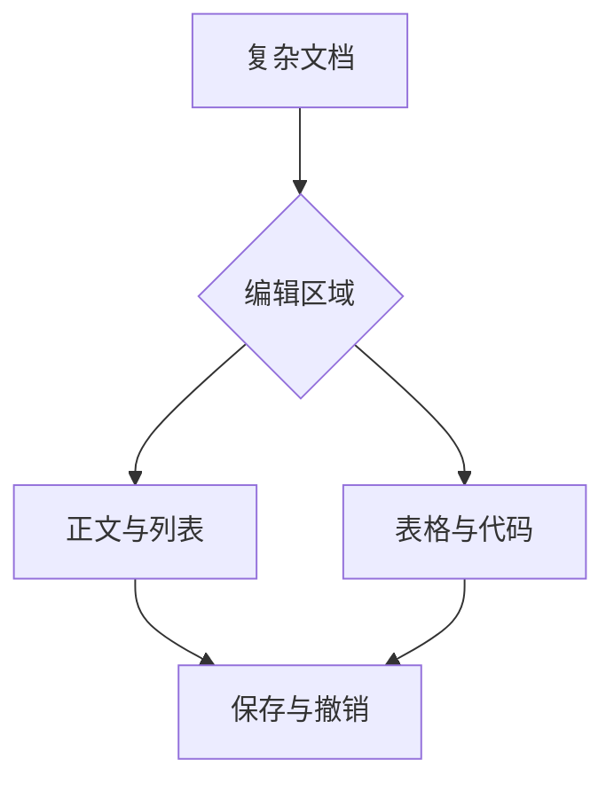
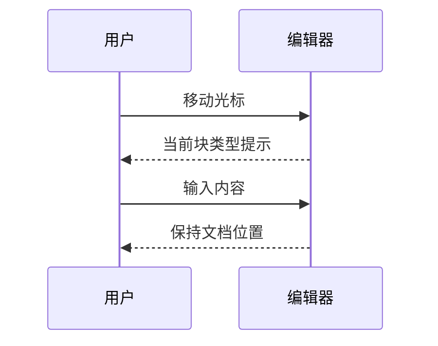

# 综合文档 H1

正文定位点：中文、English、数字 123，以及 **粗体**、*斜体*、~~删除线~~、`inline code`、[普通链接](https://example.com) 和转义 \*星号\*。

## 项目说明 H2

### 方案设计 H3

#### 接口约定 H4

##### 边界条件 H5

###### 补充说明 H6

> 引用定位点：包含 **重要说明** 和 [引用链接][guide]。
>
> > 深层引用定位点：第二层内容。
>
> #### 引用内标题
>
> - 引用内列表定位点
>   1. 引用内有序子项

- 无序定位点：第一项
  - 子列表定位点：嵌套项
    - 第三级列表内容
  - 子列表第二项
- 第二项包含软换行
  和继续的中文句子。

1. 有序定位点：准备材料
2. 开始执行
   1. 深层有序定位点：核对输入
   2. 核对输出
3. 完成记录

- [ ] 任务定位点：待完成
  - [x] 子任务定位点：已经完成
- [x] 已完成任务

| 名称 | 说明 | 数量 |
| :--- | :---: | ---: |
| 表格定位点 | **粗体**与 `code` | 123 |
| 中文长内容 | 换行<br>第二行 | 456 |
| 链接 | [引用链接][guide] | 0 |

---

## 代码与图形

```typescript
// 代码定位点
interface DocumentRecord {
  title: string;
  tags: string[];
}
const record: DocumentRecord = {
  title: "中文测试",
  tags: ["markdown", "edit"],
};
function describe(value: DocumentRecord): string {
  return `${value.title}: ${value.tags.join(", ")}`;
}
console.log(describe(record));
```

````markdown
# 围栏嵌套示例
```js
const fenced = true;
```
````

行内公式 $a^2+b^2=c^2$ 保持正文可编辑。

$$
\begin{aligned}
E &= mc^2 \\
f(x) &= \frac{1}{\sqrt{2\pi}} e^{-x^2/2}
\end{aligned}
$$






## HTML 与保留语法

<span style="color:#e53e3e">行内彩色文字定位点</span>，<u>下划线</u>、<sup>上标</sup>、<sub>下标</sub>、<mark>高亮</mark>、<kbd>Enter</kbd>。

<details>
<summary>HTML 定位点：展开说明</summary>
<p>块级 HTML 保留原文，包括 <strong>加粗内容</strong>。</p>
</details>

脚注引用示例[^note]与自动链接 <https://example.com>。

[^note]: 这是自建的脚注定义，未支持的语法也应保留原文。

[guide]: https://example.com/guide "文档引用标题"

尾部边界前的段落带两个空格。  
下一行保留换行。

## 长文第 1 节

长文段落 1：中文输入、光标导航与滚动位置需要在复杂页面中保持稳定。中文输入、光标导航与滚动位置需要在复杂页面中保持稳定。中文输入、光标导航与滚动位置需要在复杂页面中保持稳定。中文输入、光标导航与滚动位置需要在复杂页面中保持稳定。中文输入、光标导航与滚动位置需要在复杂页面中保持稳定。

- 长文条目 1
  - 嵌套条目


## 长文第 2 节

长文段落 2：中文输入、光标导航与滚动位置需要在复杂页面中保持稳定。中文输入、光标导航与滚动位置需要在复杂页面中保持稳定。中文输入、光标导航与滚动位置需要在复杂页面中保持稳定。中文输入、光标导航与滚动位置需要在复杂页面中保持稳定。中文输入、光标导航与滚动位置需要在复杂页面中保持稳定。

- 长文条目 2
  - 嵌套条目


## 长文第 3 节

长文段落 3：中文输入、光标导航与滚动位置需要在复杂页面中保持稳定。中文输入、光标导航与滚动位置需要在复杂页面中保持稳定。中文输入、光标导航与滚动位置需要在复杂页面中保持稳定。中文输入、光标导航与滚动位置需要在复杂页面中保持稳定。中文输入、光标导航与滚动位置需要在复杂页面中保持稳定。

- 长文条目 3
  - 嵌套条目


## 长文第 4 节

长文段落 4：中文输入、光标导航与滚动位置需要在复杂页面中保持稳定。中文输入、光标导航与滚动位置需要在复杂页面中保持稳定。中文输入、光标导航与滚动位置需要在复杂页面中保持稳定。中文输入、光标导航与滚动位置需要在复杂页面中保持稳定。中文输入、光标导航与滚动位置需要在复杂页面中保持稳定。

- 长文条目 4
  - 嵌套条目


## 长文第 5 节

长文段落 5：中文输入、光标导航与滚动位置需要在复杂页面中保持稳定。中文输入、光标导航与滚动位置需要在复杂页面中保持稳定。中文输入、光标导航与滚动位置需要在复杂页面中保持稳定。中文输入、光标导航与滚动位置需要在复杂页面中保持稳定。中文输入、光标导航与滚动位置需要在复杂页面中保持稳定。

- 长文条目 5
  - 嵌套条目


## 长文第 6 节

长文段落 6：中文输入、光标导航与滚动位置需要在复杂页面中保持稳定。中文输入、光标导航与滚动位置需要在复杂页面中保持稳定。中文输入、光标导航与滚动位置需要在复杂页面中保持稳定。中文输入、光标导航与滚动位置需要在复杂页面中保持稳定。中文输入、光标导航与滚动位置需要在复杂页面中保持稳定。

- 长文条目 6
  - 嵌套条目


## 长文第 7 节

长文段落 7：中文输入、光标导航与滚动位置需要在复杂页面中保持稳定。中文输入、光标导航与滚动位置需要在复杂页面中保持稳定。中文输入、光标导航与滚动位置需要在复杂页面中保持稳定。中文输入、光标导航与滚动位置需要在复杂页面中保持稳定。中文输入、光标导航与滚动位置需要在复杂页面中保持稳定。

- 长文条目 7
  - 嵌套条目


## 长文第 8 节

长文段落 8：中文输入、光标导航与滚动位置需要在复杂页面中保持稳定。中文输入、光标导航与滚动位置需要在复杂页面中保持稳定。中文输入、光标导航与滚动位置需要在复杂页面中保持稳定。中文输入、光标导航与滚动位置需要在复杂页面中保持稳定。中文输入、光标导航与滚动位置需要在复杂页面中保持稳定。

- 长文条目 8
  - 嵌套条目


## 长文第 9 节

长文段落 9：中文输入、光标导航与滚动位置需要在复杂页面中保持稳定。中文输入、光标导航与滚动位置需要在复杂页面中保持稳定。中文输入、光标导航与滚动位置需要在复杂页面中保持稳定。中文输入、光标导航与滚动位置需要在复杂页面中保持稳定。中文输入、光标导航与滚动位置需要在复杂页面中保持稳定。

- 长文条目 9
  - 嵌套条目


## 长文第 10 节

长文段落 10：中文输入、光标导航与滚动位置需要在复杂页面中保持稳定。中文输入、光标导航与滚动位置需要在复杂页面中保持稳定。中文输入、光标导航与滚动位置需要在复杂页面中保持稳定。中文输入、光标导航与滚动位置需要在复杂页面中保持稳定。中文输入、光标导航与滚动位置需要在复杂页面中保持稳定。

- 长文条目 10
  - 嵌套条目


## 长文第 11 节

长文段落 11：中文输入、光标导航与滚动位置需要在复杂页面中保持稳定。中文输入、光标导航与滚动位置需要在复杂页面中保持稳定。中文输入、光标导航与滚动位置需要在复杂页面中保持稳定。中文输入、光标导航与滚动位置需要在复杂页面中保持稳定。中文输入、光标导航与滚动位置需要在复杂页面中保持稳定。

- 长文条目 11
  - 嵌套条目


## 长文第 12 节

长文段落 12：中文输入、光标导航与滚动位置需要在复杂页面中保持稳定。中文输入、光标导航与滚动位置需要在复杂页面中保持稳定。中文输入、光标导航与滚动位置需要在复杂页面中保持稳定。中文输入、光标导航与滚动位置需要在复杂页面中保持稳定。中文输入、光标导航与滚动位置需要在复杂页面中保持稳定。

- 长文条目 12
  - 嵌套条目


## 长文第 13 节

长文段落 13：中文输入、光标导航与滚动位置需要在复杂页面中保持稳定。中文输入、光标导航与滚动位置需要在复杂页面中保持稳定。中文输入、光标导航与滚动位置需要在复杂页面中保持稳定。中文输入、光标导航与滚动位置需要在复杂页面中保持稳定。中文输入、光标导航与滚动位置需要在复杂页面中保持稳定。

- 长文条目 13
  - 嵌套条目


## 长文第 14 节

长文段落 14：中文输入、光标导航与滚动位置需要在复杂页面中保持稳定。中文输入、光标导航与滚动位置需要在复杂页面中保持稳定。中文输入、光标导航与滚动位置需要在复杂页面中保持稳定。中文输入、光标导航与滚动位置需要在复杂页面中保持稳定。中文输入、光标导航与滚动位置需要在复杂页面中保持稳定。

- 长文条目 14
  - 嵌套条目


## 长文第 15 节

长文段落 15：中文输入、光标导航与滚动位置需要在复杂页面中保持稳定。中文输入、光标导航与滚动位置需要在复杂页面中保持稳定。中文输入、光标导航与滚动位置需要在复杂页面中保持稳定。中文输入、光标导航与滚动位置需要在复杂页面中保持稳定。中文输入、光标导航与滚动位置需要在复杂页面中保持稳定。

- 长文条目 15
  - 嵌套条目


## 长文第 16 节

长文段落 16：中文输入、光标导航与滚动位置需要在复杂页面中保持稳定。中文输入、光标导航与滚动位置需要在复杂页面中保持稳定。中文输入、光标导航与滚动位置需要在复杂页面中保持稳定。中文输入、光标导航与滚动位置需要在复杂页面中保持稳定。中文输入、光标导航与滚动位置需要在复杂页面中保持稳定。

- 长文条目 16
  - 嵌套条目


## 长文第 17 节

长文段落 17：中文输入、光标导航与滚动位置需要在复杂页面中保持稳定。中文输入、光标导航与滚动位置需要在复杂页面中保持稳定。中文输入、光标导航与滚动位置需要在复杂页面中保持稳定。中文输入、光标导航与滚动位置需要在复杂页面中保持稳定。中文输入、光标导航与滚动位置需要在复杂页面中保持稳定。

- 长文条目 17
  - 嵌套条目


## 长文第 18 节

长文段落 18：中文输入、光标导航与滚动位置需要在复杂页面中保持稳定。中文输入、光标导航与滚动位置需要在复杂页面中保持稳定。中文输入、光标导航与滚动位置需要在复杂页面中保持稳定。中文输入、光标导航与滚动位置需要在复杂页面中保持稳定。中文输入、光标导航与滚动位置需要在复杂页面中保持稳定。

- 长文条目 18
  - 嵌套条目

## 文末验收

文末定位点：这里必须能连续编辑、保存，再完整撤销到原始复杂文档。
